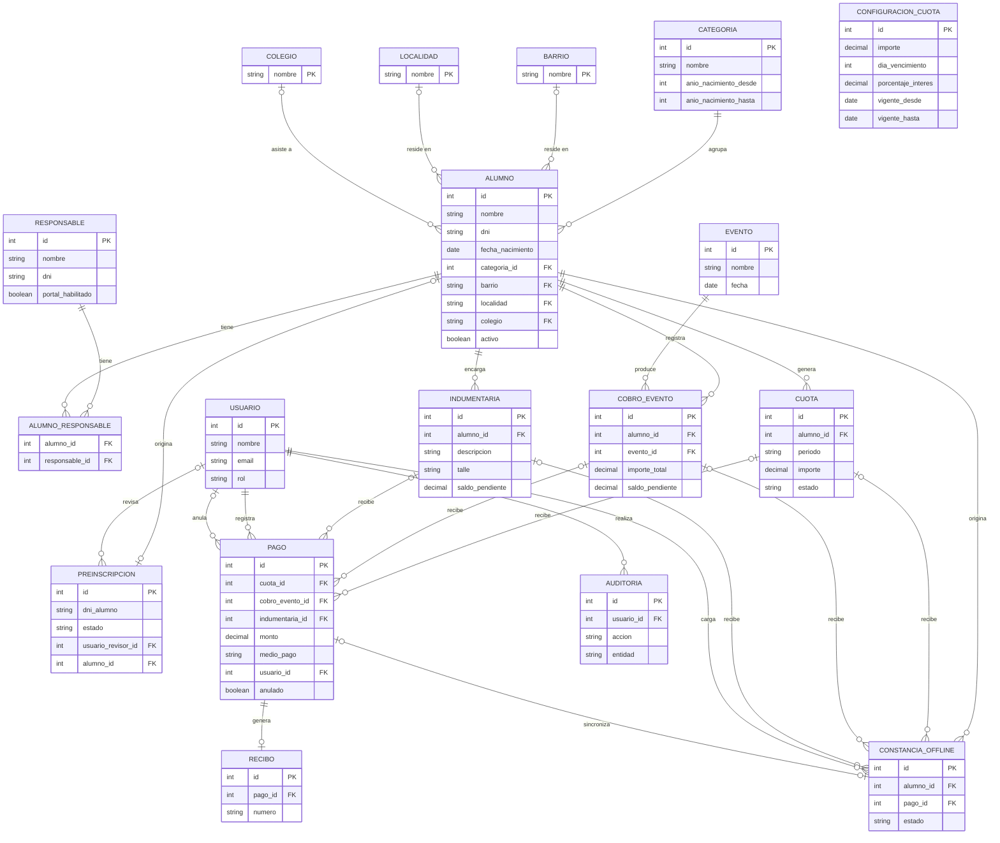

# Diseño y Módulos — Sistema de Gestión Rojas FC

**2ª Entrega — Trabajo Final Integrador**
Tecnicatura Universitaria en Programación (UTN)

---

## 1. Esquema de base de datos

Modelo relacional (MySQL). El script DDL completo se encuentra en
[`database/schema.sql`](../database/schema.sql).

### Decisiones de diseño relevantes

- **Clave primaria según el caso**: `barrio`, `localidad` y `colegio` son catálogos hoja (nada más que `alumno` los referencia) con `nombre` como clave primaria natural, en vez de sumar un `id` autoincremental que no aportaría nada. `usuario`, `responsable` y `alumno` sí usan `id` autoincremental pese a tener candidatos naturales (`email`, `dni`): son entidades con muchas tablas dependientes, y un candidato natural corregible (un DNI mal cargado, por ejemplo) forzaría propagar el cambio a cada fila que lo referencia.
- **Alumno–Responsable (N:M)**: un alumno puede tener uno o más responsables, y un responsable puede tener uno o más alumnos a cargo. Se resuelve con la tabla intermedia `alumno_responsable`.
- **Historial de cuotas**: `configuracion_cuota` guarda cada cambio de importe/vencimiento/interés con su vigencia. Al generarse una `cuota`, el importe y el interés quedan **congelados** en la fila. `cuota.interes_aplicado` evita que el recargo por mora se aplique más de una vez sobre el mismo período.
- **Cuotas sin pago parcial**: se abonan en su totalidad, tal como se definió en la 1ª Entrega; por eso `cuota` no tiene `saldo_pendiente`, a diferencia de `cobro_evento` e `indumentaria`, que sí admiten señas y pagos parciales.
- **Pagos con concepto único**: `pago` tiene tres columnas FK opcionales (`cuota_id`, `cobro_evento_id`, `indumentaria_id`) con un `CHECK` que obliga a que exactamente una esté completa, en vez de una referencia genérica sin validar. El mismo patrón se reutiliza en `constancia_offline`.
- **Anulación, no borrado**: un pago nunca se borra físicamente. `pago.anulado` (con `fecha_anulacion` y `usuario_anulador_id`) permite anular una operación incorrecta conservando la trazabilidad.
- **Procedencia normalizada**: `barrio`, `localidad` y `colegio` son catálogos propios en vez de texto libre en `alumno`. En `preinscripcion` se cargan como texto libre (tal como los ingresa la familia) y se normalizan hacia el catálogo recién al aprobarse.
- **Preinscripción pendiente sin duplicados**: la columna generada `dni_alumno_pendiente` (solo tiene valor cuando `estado = 'PENDIENTE'`) es `UNIQUE`, así que la base impide dos preinscripciones pendientes para el mismo DNI de alumno, sin bloquear DNIs ya aprobados o rechazados.
- **Login de responsables**: el portal de familias no comparte tabla con los administradores. `responsable` tiene su propio `password_hash` y usa el `dni` (ya único) como usuario. `portal_habilitado` distingue a un responsable ya validado para acceder de uno cargado sin acceso todavía.
- **Offline y sincronización**: `constancia_offline` registra lo cargado sin conexión y permanece `PENDIENTE_SINCRONIZACION` hasta que el servidor la procesa; recién ahí se crea el `pago` definitivo y se vincula (relación 1 a 1). Ante un conflicto, queda en estado `CONFLICTO` con una observación, sin tocar saldos automáticamente.
- **Baja lógica de alumnos**: `alumno.activo` + `fecha_baja`, en vez de eliminar filas, así se conserva el historial de cuotas y pagos de alumnos dados de baja.
- **Categorías sin solapamiento**: dos triggers (`BEFORE INSERT`/`BEFORE UPDATE` sobre `categoria`) rechazan un rango de año que se superponga con el de otra categoría existente. Un `CHECK` de MySQL no puede comparar contra otras filas de la misma tabla, así que la validación cruzada necesita trigger. Sin esto, la asignación automática por año de nacimiento podría volverse ambigua.
- **Un cobro por alumno y evento**: `cobro_evento` tiene `UNIQUE(alumno_id, evento_id)`. Es la opción más segura por default, no una regla de negocio confirmada — si en algún momento se necesita cobrarle dos veces el mismo evento al mismo alumno, hay que sacar esta restricción explícitamente.
- **Rangos y montos validados por `CHECK`**: `configuracion_cuota.dia_vencimiento` está acotado a 1–31; `constancia_offline.importe` exige un valor positivo, igual que ya exigía `pago.monto`.
- **Índices para reportes**: `alumno.activo`, `cuota.estado`, `cuota.fecha_vencimiento` y `pago.fecha_pago` tienen índice propio — son las columnas que va a filtrar el módulo de Reportes y Estadísticas, y no quedan cubiertas por los índices automáticos de PK/FK/UNIQUE.
- **Requisito de motor**: el esquema requiere MySQL 8.0.16 o superior — los `CHECK` no se validan en versiones anteriores.

---

## 2. Listado de módulos

Los módulos se derivan directamente del alcance aprobado en la 1ª Entrega.

| # | Módulo | Entidades principales | Funcionalidad cubierta |
|---|---|---|---|
| 1 | **Autenticación y usuarios** | `usuario`, `responsable` (login) | Login de administradores y responsables (portal), restablecimiento de contraseña |
| 2 | **Alumnos y responsables** | `alumno`, `responsable`, `alumno_responsable`, `barrio`, `localidad`, `colegio` | ABM de alumnos y responsables, bajas lógicas y reactivación, vínculo N:M, procedencia normalizada |
| 3 | **Categorías** | `categoria` | Asignación automática por año de nacimiento, reasignación manual |
| 4 | **Preinscripción y validación** | `preinscripcion` | Formulario público, control de duplicados por DNI, aprobación/rechazo, alta o reactivación del alumno |
| 5 | **Cuotas** | `cuota`, `configuracion_cuota` | Generación automática, configuración de importe/vencimiento/interés, historial, recargo único por mora |
| 6 | **Pagos y recibos** | `pago`, `recibo` | Registro y anulación de pagos, generación de recibo digital |
| 7 | **Eventos deportivos** | `evento`, `cobro_evento` | Cobros asociados a eventos, señas y pagos parciales |
| 8 | **Indumentaria** | `indumentaria` | Cobros por encargo (con talle), señas y pagos parciales |
| 9 | **Offline y sincronización** | `constancia_offline` | Registro de pagos sin conexión, sincronización posterior, manejo de conflictos |
| 10 | **Portal de responsables** | `alumno`, `cuota`, `pago` (solo lectura) | Consulta de situación administrativa de los alumnos a cargo del responsable autenticado |
| 11 | **Reportes y estadísticas** | vistas sobre `alumno`, `cuota`, `pago`, `cobro_evento`, `barrio`, `localidad`, `colegio` | Dashboard, exportación, indicadores por categoría, deuda, recaudación y procedencia |
| 12 | **Auditoría** | `auditoria` | Registro de operaciones relevantes del sistema |

Cada módulo corresponde a un conjunto de entidades ya definido en el esquema, sin agregar entidades ni funcionalidades fuera del alcance comprometido en la 1ª Entrega.
