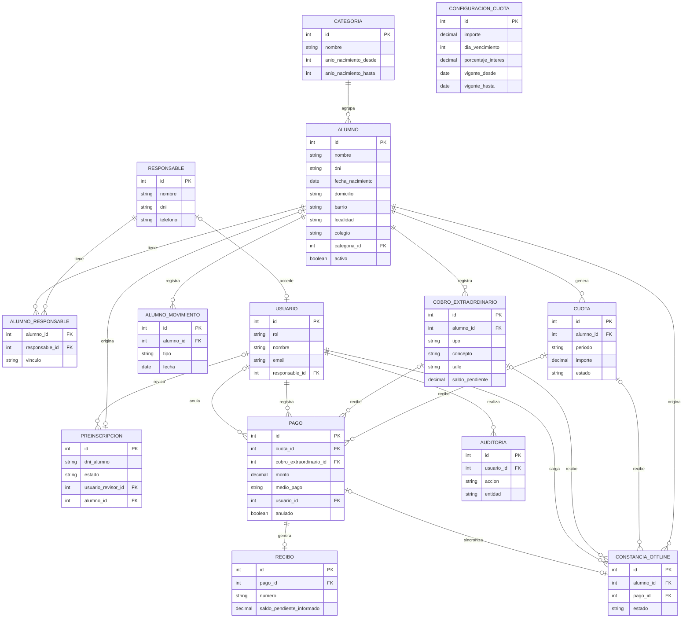

# Diseño de Base de Datos — Sistema de Gestión Rojas FC

**2ª Entrega — Trabajo Final Integrador**
Tecnicatura Universitaria en Programación (UTN)

El listado de módulos vive en [`docs/modulos/propuesta-modulos.md`](modulos/propuesta-modulos.md). Este documento cubre solo el modelado de entidades y el esquema de base de datos, construidos contra [`docs/requisitos/requisitos-funcionales.md`](requisitos/requisitos-funcionales.md), [`docs/requisitos/requisitos-no-funcionales.md`](requisitos/requisitos-no-funcionales.md) y [`docs/reglas-negocio/reglas-de-negocio.md`](reglas-negocio/reglas-de-negocio.md).

---

## 1. Esquema de base de datos

Modelo relacional (MySQL). El script DDL completo se encuentra en [`database/schema.sql`](../database/schema.sql).

### Decisiones de diseño relevantes

- **`usuario` unificado (Administrador, Coordinador y Responsable):** una sola tabla de acceso para los tres perfiles, en vez de credenciales separadas en `usuario` y `responsable`. Administrador/Coordinador se identifican por `email`; Responsable se identifica con el DNI de su fila en `responsable` (vía `responsable_id`, sin duplicarlo). `responsable_id` es `NULL` y `UNIQUE`: un responsable puede existir sin tener todavía cuenta de acceso, y cuando la tiene, es una sola. Un `CHECK` obliga a que cada fila tenga los datos que corresponden a su rol (nombre y email solo para el personal interno, `responsable_id` solo para el rol Responsable).
- **Sin catálogos de procedencia:** `barrio`, `localidad` y `colegio` son texto libre en `alumno` y en `preinscripcion`, porque ningún requisito o regla de negocio pide normalizarlos en tablas propias.
- **`cobro_extraordinario` unifica evento, indumentaria y matrícula:** una sola tabla con `tipo` (`EVENTO`/`INDUMENTARIA`/`MATRICULA`) en vez de tablas separadas. Ningún RF pide un catálogo reutilizable de eventos — solo registrar y consultar el cobro asociado a un alumno con su concepto — y la matrícula (RN-29) tiene exactamente la misma forma (cobro puntual, importe, saldo), así que se modela ahí en vez de en su propia tabla.
- **Máximo 2 responsables por alumno (RN-05):** `alumno_responsable` tiene un trigger en `INSERT` y otro en `UPDATE` que rechazan el tercer responsable (el de `UPDATE` cubre el caso de reasignar una fila existente a otro alumno). `vinculo` (madre/padre/tutor) es obligatorio por RN-09; no hay jerarquía entre responsables (RN-06), por eso no hay un flag de "principal".
- **Cuotas sin pago parcial (RN-30):** `cuota` no tiene `saldo_pendiente`, a diferencia de `cobro_extraordinario`, que sí admite pagos parciales (RN-41) y por eso lo tiene.
- **Una sola cuota, un solo pago válido:** `pago.cuota_id_activo` (columna generada, `NULL` cuando `anulado = TRUE`) tiene `UNIQUE`, así que no puede haber dos pagos no anulados para la misma cuota — sí pueden convivir varios pagos anulados históricos para esa cuota, como ya contempla el modelo Cuota–Pago.
- **Cuota pagada, protegida (RN-25):** un trigger rechaza modificar el `importe` de una cuota cuyo estado ya es `PAGADA`.
- **`medio_pago` opcional (RN-32):** no es obligatorio — se puede omitir cuando la administración no dispone de ese dato.
- **Anulación exige motivo (RN-34):** `pago.motivo_anulacion` es obligatorio cuando `anulado = TRUE`, validado con `CHECK`.
- **Recibo informa saldo solo en extraordinarios parciales (RN-38):** `recibo.saldo_pendiente_informado` es `NULL` salvo cuando el pago corresponde a un cobro extraordinario abonado parcialmente.
- **Categorías sin solapamiento:** dos triggers (`BEFORE INSERT`/`BEFORE UPDATE` sobre `categoria`) rechazan un rango de año que se superponga con el de otra categoría existente — un `CHECK` no puede comparar contra otras filas de la misma tabla.
- **Pagos con concepto único:** `pago` y `constancia_offline` referencian exactamente un concepto (`cuota` o `cobro_extraordinario`) mediante `CHECK`.
- **Baja lógica de alumnos:** `alumno.activo` + `fecha_baja`, en vez de eliminar filas, así se conserva el historial de cuotas y pagos.
- **Historial de altas y bajas (RF-51):** `alumno.fecha_alta`/`fecha_baja` solo guardan el movimiento más reciente. `alumno_movimiento` registra cada transición por separado, para poder responder correctamente si un alumno se dio de baja y reingresó más de una vez (RN-03). La reactivación se registra como un evento `ALTA` más sobre el mismo `alumno_id`, no como un tipo aparte. Queda a cargo de la aplicación insertar la fila correspondiente junto con el cambio de `alumno.activo`, en la misma operación — no hay trigger automático, para evitar registrar movimientos por actualizaciones que no son altas/bajas reales.
- **Sin módulo de auditoría, con tabla de auditoría:** `auditoria` existe para dar soporte a RNF-12 (trazabilidad), aunque no hay un módulo funcional propio con pantalla.
- **Requisito de motor:** MySQL 8.0.16 o superior — los `CHECK` no se validan en versiones anteriores. Los triggers usan el meta-comando `DELIMITER`, propio del cliente `mysql`: si el script se ejecuta vía JDBC en modo batch hay que crearlos aparte.
- **Índices (issue #15):** además de los que ya crea automáticamente cada PK/FK/UNIQUE, se agregaron `alumno(apellido, nombre)` (RF-45, búsqueda por nombre), `cuota(estado, alumno_id)` (compuesto, cubre la consulta de morosidad sin ir a buscar la fila completa) y `preinscripcion(estado)` (RF-18/RF-55). Deliberadamente **no** se indexan `barrio`/`localidad`/`colegio` ni `tipo` en `cobro_extraordinario`: son filtros sobre una tabla de pocas filas (~140 alumnos), donde un índice más cuesta en escritura sin mejorar la lectura de forma real. El historial de pagos de un alumno (RF-34) no necesita índice propio en `pago`: se llega por join a través de `cuota`/`cobro_extraordinario`, ya indexados por sus FK.

### Diferencia con la versión anterior de este DER

Dos cambios respecto a la versión previa (sigue en 14 tablas, no cambia la cantidad):

1. Se agrega `alumno_movimiento` (historial de altas/bajas, RF-51).
2. `usuario` y `responsable` pasan a estar vinculados (`usuario.responsable_id`) en vez de tener cada una su propio mecanismo de login: se adopta la propuesta conceptual de Marina y Silvia (issues #10/#11) de unificar el acceso de los tres perfiles bajo una sola tabla `usuario`, en lugar de la decisión anterior de mantenerlos separados.

El resto del modelo —incluido `constancia_offline` como tabla propia— se revisó contra la propuesta conceptual de entidades (`docs/entidades-relaciones-cardinalidad/entidades-relaciones-cardinalidad.md`) y se mantiene sin cambios; el detalle de esa revisión está en los comentarios del issue #11.

### No duplicidad de alumnos y responsables

`alumno.dni` y `responsable.dni` son `UNIQUE` — la base rechaza un segundo registro con el mismo DNI en cualquiera de las dos tablas, sin importar por qué camino se intente crear (alta directa o preinscripción aprobada).
