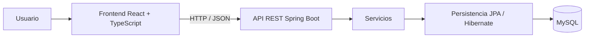

# Arquitectura Inicial — Sistema de Gestión Rojas FC

## 1. Objetivo

Este documento consolida la arquitectura inicial del Sistema de Gestión Rojas FC a partir de las decisiones técnicas ya acordadas y del diseño funcional vigente.

La arquitectura se define con un enfoque simple, mantenible y acorde al alcance actual del Trabajo Final Integrador, evitando incorporar infraestructura o componentes que no estén justificados por las necesidades reales del sistema.

---

## 2. Stack tecnológico acordado

- **Frontend:** React + TypeScript + Vite.
- **Backend:** Java + Spring Boot.
- **Comunicación:** API REST.
- **Base de datos:** MySQL.
- **Persistencia:** JPA / Hibernate.
- **Autenticación:** JWT.
- **Estructura principal del repositorio:**
  - `/frontend`
  - `/backend`
  - `/database`
  - `/docs`

---

## 3. Arquitectura general

El sistema seguirá una arquitectura web cliente-servidor.

El frontend será responsable de la interacción con el usuario y consumirá los servicios publicados por el backend mediante una API REST. El backend concentrará la lógica de negocio, la seguridad, las validaciones y el acceso a datos. MySQL será la base de datos relacional principal del sistema.



El frontend no accederá directamente a la base de datos.

---

## 4. Componentes principales del frontend

### 4.1. Capa de presentación

Incluye las pantallas, formularios, tablas, listados, dashboard, reportes visibles y elementos de navegación necesarios para que los usuarios interactúen con el sistema.

### 4.2. Gestión de autenticación y autorización

Administra el estado de sesión del usuario, el uso del token JWT y la visualización de funcionalidades según el perfil autenticado.

La restricción definitiva de permisos se realizará siempre en el backend.

### 4.3. Servicios de comunicación con la API

Centralizan las solicitudes HTTP al backend y el intercambio de información en formato JSON.

### 4.4. Gestión de estado

Administra los datos temporales que necesita la interfaz durante el uso de la aplicación.

No se define en esta etapa una librería específica para la gestión de estado.

### 4.5. Ruteo y protección de rutas

Organiza la navegación entre las distintas pantallas y restringe el acceso a determinadas rutas según el perfil autenticado.

### 4.6. Soporte offline limitado

Permite conservar temporalmente la información necesaria para las operaciones habilitadas sin conexión y realizar su posterior sincronización.

El mecanismo concreto de almacenamiento local se definirá en una etapa técnica posterior.

---

## 5. Componentes principales del backend

### 5.1. Controladores REST

Reciben las solicitudes realizadas por el frontend, exponen los endpoints de la API y delegan el procesamiento en la capa de servicios.

### 5.2. Servicios

Concentran la lógica de negocio, las validaciones funcionales y la coordinación de las operaciones del sistema.

### 5.3. Persistencia

Gestiona el acceso a datos mediante repositorios y JPA / Hibernate, manteniendo separada la lógica de negocio de la interacción directa con MySQL.

### 5.4. Modelo de dominio y DTOs

El modelo de dominio representa las entidades y conceptos internos del negocio.

Los DTOs se utilizan para intercambiar información entre la API y el frontend sin exponer directamente las entidades internas del sistema.

### 5.5. Seguridad

Gestiona la autenticación, la validación de JWT y la autorización de las operaciones según el perfil del usuario.

### 5.6. Validaciones y manejo de errores

Centraliza la validación de datos de entrada y la generación de respuestas consistentes ante errores de validación, conflictos o incumplimientos de reglas de negocio.

---

## 6. Comunicación mediante API REST

La comunicación entre frontend y backend se realizará mediante solicitudes HTTP a una API REST.

Los datos se intercambiarán principalmente en formato JSON.

El flujo general será:

```text
Frontend → Controlador REST → Servicio → Persistencia → MySQL
```

La respuesta seguirá el camino inverso hasta llegar al frontend.

Para las operaciones protegidas, el frontend enviará el JWT correspondiente y el backend validará la identidad y autorización del usuario antes de ejecutar la operación.

Las respuestas de error deberán mantener una estructura uniforme para facilitar su interpretación desde el frontend.

---

## 7. Integración con MySQL

MySQL será la base de datos relacional principal del sistema.

El backend será el único componente con acceso directo a la base de datos.

La integración se realizará mediante JPA / Hibernate y repositorios.

Las entidades del dominio se vincularán con el esquema relacional definido para el sistema.

Cuando una operación involucre varios cambios relacionados que deban mantenerse consistentes, la gestión transaccional se realizará desde el backend.

---

## 8. Autenticación y autorización

La autenticación permitirá comprobar la identidad del usuario mediante sus credenciales.

Una vez validadas, el backend emitirá un JWT que deberá enviarse en las solicitudes protegidas.

La autorización determinará qué operaciones puede realizar cada usuario según su perfil.

A nivel general se contemplan los perfiles:

- Administrador / Coordinador.
- Responsable.

El frontend podrá ocultar o deshabilitar opciones que no correspondan al perfil autenticado, pero la validación definitiva de permisos se realizará siempre en el backend.

---

## 9. Funcionamiento offline limitado

El sistema no se plantea como una aplicación completamente offline.

El alcance sin conexión será controlado y limitado a las funcionalidades expresamente definidas para este modo.

Se contempla:

- acceso a información básica previamente disponible;
- registro provisional de determinadas operaciones permitidas sin conexión, principalmente pagos;
- almacenamiento temporal de esas operaciones;
- sincronización posterior cuando se recupere la conexión;
- validación de la operación por parte del backend;
- notificación de conflictos de sincronización cuando corresponda;
- emisión del recibo definitivo únicamente después de la sincronización y confirmación del backend.

No se replicará toda la base de datos en el dispositivo ni se habilitarán todas las funcionalidades sin conexión.

El mecanismo concreto de almacenamiento y sincronización se definirá posteriormente como una decisión técnica de implementación.

---

## 10. Relación entre arquitectura y módulos funcionales

Los módulos funcionales se implementarán sobre una arquitectura común.

En el frontend, cada módulo tendrá las pantallas, formularios, listados y vistas que necesite.

En el backend, las operaciones de cada módulo se resolverán mediante controladores, servicios y acceso a persistencia según corresponda.

La comunicación entre ambas partes se realizará siempre mediante la API REST.

Los módulos de búsqueda, reportes y dashboard consumirán información generada por otros módulos sin requerir una arquitectura independiente.

Las capacidades transversales, como autenticación, autorización, validaciones, trazabilidad y soporte offline, serán compartidas por los módulos que las necesiten.

---

## 11. Criterios de simplicidad de infraestructura

Para esta etapa se prioriza una infraestructura simple y suficiente para el alcance actual del sistema.

Se establecen los siguientes criterios:

- no utilizar microservicios;
- mantener frontend y backend como aplicaciones separadas comunicadas mediante API REST;
- utilizar una única base de datos MySQL;
- no incorporar colas de mensajería, múltiples bases de datos, balanceadores, Kubernetes u otros componentes distribuidos sin una necesidad concreta;
- priorizar un despliegue inicial sencillo y mantenible;
- incorporar mayor complejidad únicamente si el crecimiento futuro del sistema o nuevos requisitos la justifican.

---

## 12. Alcance de esta definición

Este documento describe la arquitectura inicial a nivel general.

No define todavía:

- endpoints definitivos;
- librerías específicas de gestión de estado;
- estrategia física definitiva de almacenamiento offline;
- infraestructura avanzada de despliegue;
- detalles de implementación que dependan del esquema relacional definitivo.

Estas decisiones podrán detallarse en etapas posteriores sin modificar los principios arquitectónicos establecidos en este documento.
