# Propuesta de DER conceptual — revisión

**Trabajo Final Integrador — Sistema de Gestión Rojas FC**

Este documento presenta una propuesta de **DER conceptual** elaborada a partir de la devolución docente recibida sobre el modelo anterior y de la revisión posterior del equipo.

El objetivo es validar primero las entidades, relaciones, cardinalidades y restricciones propias del dominio, antes de avanzar con claves, restricciones de integridad, modelo relacional o esquema físico.

> Esta propuesta está destinada a revisión del equipo y del tutor. No reemplaza todavía el modelo principal ni el `schema.sql`.

---

## 1. Criterios aplicados en esta revisión

Para mantener el modelo en un nivel conceptual se evita incorporar:

- IDs técnicos;
- PK y FK;
- tipos SQL;
- índices;
- triggers;
- columnas generadas;
- mecanismos físicos para impedir solapamientos o duplicaciones.

Se prioriza representar el significado de cada entidad dentro del dominio, sus relaciones y las reglas conceptuales que deben cumplirse.

---

## 2. Entidades propuestas

### Persona

Representa a una persona real identificada dentro del sistema.

**Atributos conceptuales:**
- DNI
- Nombre
- Apellido

El DNI es obligatorio para toda Persona, incluidos Administradores/Coordinadores, e identifica globalmente a la persona dentro del sistema. No deben existir dos Personas distintas con el mismo DNI.

### Alumno

Especialización de Persona. Representa al menor registrado en la escuela.

**Atributos conceptuales:**
- Fecha de nacimiento
- Colegio
- Domicilio
- Barrio
- Localidad

### Responsable

Especialización de Persona. Representa al adulto responsable de uno o más alumnos.

**Atributos conceptuales:**
- Teléfono

El vínculo madre/padre/tutor pertenece a la relación Alumno–Responsable.

La especialización de Persona es **parcial y no exclusiva**: una Persona puede no desempeñar ninguno de estos roles, puede desempeñar uno de ellos o ambos si el dominio lo requiere.

### Usuario

Representa la cuenta de acceso al sistema asociada a una Persona.

**Atributos conceptuales:**
- Contraseña
- Rol
- Estado de cuenta

Todo Usuario corresponde a una Persona y una Persona puede tener como máximo una cuenta.

El DNI utilizado para iniciar sesión pertenece a Persona y no se duplica en Usuario. Tanto Responsable como Administrador/Coordinador se autentican mediante DNI y contraseña.

El rol de Usuario determina las funcionalidades disponibles en el sistema; no reemplaza las especializaciones Alumno y Responsable de Persona.

### Preinscripción

Entidad temporal que representa un formulario recibido y pendiente de revisión.

**Atributos conceptuales:**
- Fecha
- Observaciones
- Datos declarados del alumno:
  - Nombre
  - Apellido
  - DNI
  - Fecha de nacimiento
  - Domicilio
  - Barrio
  - Localidad
  - Colegio
- Datos declarados del responsable principal:
  - Nombre
  - Apellido
  - DNI
  - Teléfono
  - Vínculo
- Datos equivalentes de un segundo responsable, de manera opcional.

La Preinscripción conserva datos temporales del formulario y no representa todavía una Persona, un Alumno o un Responsable definitivo.

Mientras existe, se considera pendiente de revisión. Se elimina cuando:
- sus datos son procesados para crear o reutilizar Persona, Alumno y Responsable;
- el DNI corresponde a un Alumno ya existente y la solicitud se resuelve sobre ese registro;
- el administrador decide descartarla.

Si el Alumno existente se encuentra inactivo, se reutiliza su registro para una eventual reactivación. No se crea un nuevo Alumno.

No se conserva historial de preinscripciones.

### Movimiento de Alumno

Representa los cambios administrativos del Alumno a lo largo del tiempo.

**Atributos conceptuales:**
- Tipo de movimiento
- Fecha
- Observación

Tipos previstos:
- Alta
- Baja
- Reactivación

Un Alumno nuevo genera un movimiento Alta; una baja genera Baja; y el regreso de un Alumno inactivo genera Reactivación. El estado actual del Alumno se deriva del último movimiento válido.

### Configuración de Cuota

Representa las condiciones generales utilizadas para generar cuotas mensuales.

**Atributos conceptuales:**
- Importe general
- Día de vencimiento
- Porcentaje de interés
- Vigente desde

Para una fecha o período determinado debe existir una única Configuración de Cuota aplicable. Una nueva configuración reemplaza a la anterior únicamente para cuotas futuras.

Cada Cuota conserva la relación con la Configuración utilizada al momento de su generación, de modo que las modificaciones posteriores no alteran las cuotas ya generadas.

No se incorpora `Vigente hasta` en esta etapa conceptual; los mecanismos para evitar solapamientos se definirán al trabajar restricciones de integridad.

### Condición Particular de Cuota

Representa un importe de cuota particular aplicado a un Alumno cuando corresponde una excepción respecto del importe general.

**Atributos conceptuales:**
- Importe particular
- Motivo
- Vigente desde

Un Alumno puede tener varias condiciones a lo largo del tiempo, pero solo una puede estar vigente simultáneamente. Una nueva condición reemplaza a la anterior para cuotas futuras.

No se diferencia porcentaje, descuento o tipo de ajuste porque los requisitos actuales solo exigen poder establecer un importe de cuota diferente del valor general.

### Obligación de Pago

Representa una obligación económica concreta asociada a un Alumno.

**Atributos conceptuales:**
- Importe

Toda Obligación de Pago debe corresponder exactamente a uno de estos tipos:
- Cuota
- Matrícula
- Cobro Extraordinario

La especialización es total y exclusiva.

### Cuota

Especialización de Obligación de Pago. Representa la obligación mensual concreta de un Alumno.

**Atributos conceptuales:**
- Período
- Fecha de vencimiento
- Interés aplicado

El saldo, el estado de la cuota y la condición de morosidad son datos derivados.

### Matrícula

Especialización de Obligación de Pago. Representa el cobro vinculado al ingreso del Alumno a la escuela.

**Atributos conceptuales:**
- Mes
- Año

La Matrícula debe cancelarse en una única operación por su importe total. Los pagos parciales quedan limitados a los cobros extraordinarios de Evento o Indumentaria.

### Cobro Extraordinario

Especialización de Obligación de Pago. Representa un cobro no periódico asociado a un Alumno.

Cada Cobro Extraordinario corresponde exactamente a un Evento o a un Pedido de Indumentaria, nunca a ambos.

### Evento

Representa un evento de la escuela que puede originar cobros extraordinarios para distintos alumnos.

**Atributos conceptuales:**
- Nombre
- Año

### Pedido de Indumentaria

Representa un pedido individual de indumentaria.

**Atributos conceptuales:**
- Tipo de prenda
- Talle

### Pago

Representa una operación económica real registrada para un único Alumno.

**Atributos conceptuales:**
- Fecha
- Importe total
- Medio de pago
- Anulado
- Motivo de anulación

El medio de pago es opcional. Se mantiene como atributo controlado porque actualmente solo contempla Efectivo y Transferencia y no posee atributos o reglas propias que justifiquen una entidad independiente.

El motivo de anulación es obligatorio cuando el Pago está anulado.

### Aplicación de Pago

Representa la distribución de un Pago entre una o más Obligaciones de Pago del mismo Alumno.

**Atributos conceptuales:**
- Importe aplicado

Un Pago puede cubrir varias obligaciones del mismo Alumno. No puede distribuirse entre alumnos distintos.

### Recibo

Representa el comprobante asociado a un Pago confirmado.

**Atributos conceptuales:**
- Número
- Fecha de emisión

El Alumno, los conceptos abonados, los importes aplicados, el importe total y el medio de pago se obtienen a partir de Pago, Aplicación de Pago y Obligación de Pago.

Cuando corresponde un pago parcial de un Cobro Extraordinario, el saldo pendiente también se obtiene a partir de esas relaciones y de las aplicaciones válidas existentes.

---

## 3. DER conceptual propuesto

El código fuente editable y actualizado del diagrama se conserva en [`der-conceptual.mmd`](./der-conceptual.mmd).

> La imagen SVG debe regenerarse luego de esta revisión para incorporar visualmente la relación Alumno–Pago agregada al código fuente actualizado.

> La Preinscripción se representa como entidad aislada. Los tipos `string` visibles en esa entidad se utilizan únicamente como recurso para que Mermaid pueda dibujarla sin relaciones; no constituyen una decisión del modelo físico.

---

## 4. Relaciones y cardinalidades

### Persona — Alumno
- Una Persona puede ser 0..1 Alumno.
- Cada Alumno corresponde a 1 Persona.

### Persona — Responsable
- Una Persona puede ser 0..1 Responsable.
- Cada Responsable corresponde a 1 Persona.

### Persona — Usuario
- Una Persona puede tener 0..1 Usuario.
- Cada Usuario pertenece a 1 Persona.

### Alumno — Responsable
- Un Alumno debe tener entre 1 y 2 Responsables.
- Un Responsable puede estar asociado a uno o más Alumnos.
- La relación posee el atributo **vínculo**: madre, padre o tutor.

### Alumno — Movimiento de Alumno
- Un Alumno tiene 1..N Movimientos.
- Cada Movimiento pertenece a 1 Alumno.

### Alumno — Condición Particular de Cuota
- Un Alumno puede tener 0..N Condiciones Particulares.
- Cada Condición Particular pertenece a 1 Alumno.
- Solo una puede estar vigente simultáneamente.

### Alumno — Obligación de Pago
- Un Alumno puede tener 0..N Obligaciones de Pago.
- Cada Obligación de Pago pertenece a 1 Alumno.

### Obligación de Pago — Cuota / Matrícula / Cobro Extraordinario
- Toda Obligación de Pago debe ser exactamente una Cuota, una Matrícula o un Cobro Extraordinario.
- La especialización es total y exclusiva.
- Una misma obligación no puede pertenecer simultáneamente a más de un subtipo.

### Configuración de Cuota — Cuota
- Una Configuración puede generar 0..N Cuotas.
- Cada Cuota se genera a partir de 1 Configuración.

### Evento — Cobro Extraordinario
- Un Evento puede originar 0..N Cobros Extraordinarios.
- Un Cobro Extraordinario puede corresponder a 0..1 Evento.

### Pedido de Indumentaria — Cobro Extraordinario
- Cada Pedido de Indumentaria corresponde a 1 Cobro Extraordinario.
- Un Cobro Extraordinario puede corresponder a 0..1 Pedido de Indumentaria.

Cada Cobro Extraordinario debe corresponder exactamente a un Evento o a un Pedido de Indumentaria, nunca a ambos.

### Alumno — Pago
- Un Alumno puede tener 0..N Pagos.
- Cada Pago corresponde a 1 Alumno.

### Pago — Aplicación de Pago
- Un Pago tiene 1..N Aplicaciones de Pago.
- Cada Aplicación de Pago pertenece a 1 Pago.

### Obligación de Pago — Aplicación de Pago
- Una Obligación de Pago puede recibir 0..N Aplicaciones de Pago.
- Cada Aplicación de Pago se aplica a 1 Obligación de Pago.
- Todas las Obligaciones alcanzadas por las Aplicaciones de un mismo Pago deben pertenecer al mismo Alumno asociado al Pago.

### Pago — Recibo
- Un Pago puede tener 0..1 Recibo.
- Cada Recibo pertenece a 1 Pago.
- Un Pago confirmado genera un único Recibo.

---

## 5. Restricciones conceptuales relevantes

- El DNI es obligatorio e identifica globalmente a Persona.
- No deben existir dos Personas distintas con el mismo DNI.
- Alumno y Responsable son especializaciones de Persona.
- La especialización de Persona es parcial y no exclusiva.
- Toda cuenta Usuario corresponde a una Persona y una Persona puede tener como máximo una cuenta.
- Tanto Responsable como Administrador/Coordinador utilizan DNI y contraseña para autenticarse.
- Un Alumno debe tener entre 1 y 2 Responsables.
- El estado actual del Alumno se deriva de su último Movimiento de Alumno válido.
- La categoría del Alumno se deriva de su fecha de nacimiento y no se modela como entidad independiente.
- Para una fecha o período debe existir una única Configuración de Cuota aplicable; una nueva configuración se utiliza solo para cuotas futuras.
- Solo una Condición Particular de Cuota puede estar vigente simultáneamente para un Alumno.
- La Condición Particular expresa directamente el importe particular aplicable.
- Obligación de Pago concentra el importe común y representa cualquier obligación económica del Alumno.
- Toda Obligación de Pago se especializa de forma total y exclusiva en Cuota, Matrícula o Cobro Extraordinario.
- Cada Cobro Extraordinario corresponde exactamente a un Evento o a un Pedido de Indumentaria, nunca a ambos.
- Cada Pago corresponde a un único Alumno.
- Un Pago puede distribuirse entre varias Obligaciones de Pago, siempre que todas pertenezcan a ese mismo Alumno.
- La suma de los importes de las Aplicaciones de Pago debe coincidir con el importe total del Pago.
- La posibilidad de que una Obligación posea varias Aplicaciones no implica que todos sus tipos admitan pagos parciales.
- Las Cuotas y las Matrículas deben cancelarse en una única operación por el importe total adeudado.
- Los pagos parciales están permitidos únicamente para Cobros Extraordinarios correspondientes a Evento o Pedido de Indumentaria.
- Los registros históricos derivados de pagos anulados no representan pagos parciales válidos.
- El medio de pago se mantiene como atributo controlado de Pago porque actualmente no posee información o reglas propias.
- El estado de una Cuota se deriva de su fecha de vencimiento, las Aplicaciones de Pago válidas, las anulaciones y el saldo resultante; no se almacena como un texto independiente.
- El saldo, la deuda total y la morosidad se consideran datos derivados.
- La Preinscripción es temporal e independiente de Persona, Alumno y Responsable mientras se encuentra pendiente.
- No se conserva historial de preinscripciones una vez procesadas o descartadas.
- El funcionamiento offline y la auditoría/trazabilidad continúan siendo requisitos del sistema, pero no se modelan como entidades funcionales del DER conceptual.

---

## 6. Alcance de decisiones posteriores

Algunas cuestiones señaladas durante la revisión se mantienen deliberadamente fuera del DER conceptual y se resolverán en las etapas siguientes:

- mecanismos físicos para garantizar unicidad;
- claves e identificadores;
- restricciones para impedir solapamientos temporales;
- necesidad o no de incorporar `Vigente hasta` en el modelo relacional;
- mecanismos técnicos de auditoría y trazabilidad;
- persistencia del Usuario que registra o anula un Pago o que revisa una Preinscripción;
- índices, triggers y demás decisiones de implementación.

Los requisitos actuales establecen qué perfiles pueden realizar esas acciones, pero la necesidad de persistir al Usuario concreto que las ejecutó se evaluará junto con las decisiones de trazabilidad.

---

## 7. Decisiones de modelado consolidadas para validación

1. **Persona como entidad base**, con DNI obligatorio y globalmente identificador.
2. **Alumno y Responsable como especializaciones parciales y no exclusivas de Persona**.
3. **Usuario asociado a Persona**, con autenticación mediante DNI y contraseña para Responsable y Administrador/Coordinador.
4. **Preinscripción como entidad temporal**, con datos estructurados del formulario, sin relación permanente con las entidades definitivas y sin conservación de historial.
5. **Movimiento de Alumno** como fuente del historial de altas, bajas y reactivaciones.
6. **Configuración de Cuota** aplicable por vigencia desde, sin alterar cuotas ya generadas.
7. **Condición Particular de Cuota simplificada** a importe particular, motivo y vigencia desde.
8. **Obligación de Pago como superentidad**, asociada al Alumno y especializada de forma total y exclusiva en Cuota, Matrícula o Cobro Extraordinario.
9. **Importe ubicado en Obligación de Pago**, evitando repetirlo en los tres subtipos.
10. **Pago asociado a un único Alumno**.
11. **Separación entre Pago y Aplicación de Pago**, permitiendo distribuir un Pago entre varias obligaciones del mismo Alumno.
12. **Aplicación de Pago relacionada con Obligación de Pago**.
13. **Cuotas y Matrículas sin pagos parciales; pagos parciales limitados a Evento e Indumentaria**.
14. **Cobro Extraordinario relacionado con Evento o Pedido de Indumentaria**, sin tratarlos como subtipos del cobro.
15. **Recibo derivado del Pago y sus Aplicaciones**, siempre correspondiente a un único Alumno.
16. **Medio de Pago como atributo controlado**.
17. **Estado de Cuota, saldo, deuda y morosidad como datos derivados**.
18. **Offline y auditoría como capacidades transversales, no entidades del DER conceptual**.

---

## 8. Próximos pasos

Una vez validado este modelo conceptual por el equipo y el tutor:

1. regenerar la imagen SVG a partir del código Mermaid actualizado;
2. ajustar el DER si corresponde;
3. actualizar el documento de entidades, relaciones y cardinalidades;
4. revisar claves y restricciones de integridad;
5. construir el modelo relacional;
6. actualizar el esquema físico de base de datos;
7. alinear `schema.sql` y la documentación de la segunda entrega.
