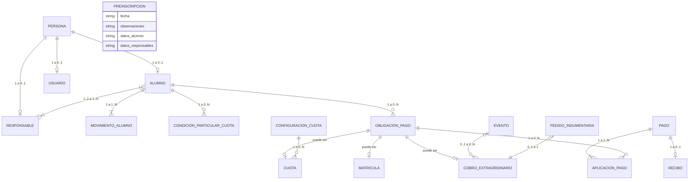

# Propuesta de DER conceptual — revisión

**Trabajo Final Integrador — Sistema de Gestión Rojas FC**

Este documento presenta una propuesta de **DER conceptual** elaborada a partir de la devolución docente recibida sobre el modelo anterior.

El objetivo es revisar y validar primero las entidades, relaciones, cardinalidades y restricciones del dominio, antes de avanzar con claves, restricciones físicas o esquema relacional.

> Esta propuesta está destinada a revisión del equipo y del tutor. No reemplaza todavía el modelo principal ni el `schema.sql`.

---

## 1. Criterios aplicados en esta revisión

Para mantener el modelo en un nivel conceptual se evita incorporar:

- IDs técnicos.
- PK y FK.
- Tipos SQL.
- Índices.
- Triggers.
- Columnas generadas.
- Decisiones propias del modelo físico.

Se prioriza representar el significado de cada entidad dentro del dominio y sus relaciones.

---

## 2. Entidades propuestas

### Persona
Representa a una persona real identificada dentro del sistema.

**Atributos conceptuales:**
- DNI
- Nombre
- Apellido

### Alumno
Especialización de Persona. Representa al menor registrado en la escuela.

**Atributos conceptuales:**
- Fecha de nacimiento
- Colegio
- Domicilio
- Barrio
- Localidad

### Responsable
Especialización de Persona. Representa al adulto responsable de uno o más alumnos.

**Atributos conceptuales:**
- Teléfono

El vínculo madre/padre/tutor pertenece a la relación Alumno–Responsable.

### Usuario
Representa la cuenta de acceso al sistema asociada a una Persona.

**Atributos conceptuales:**
- Contraseña
- Rol
- Estado de cuenta

El DNI no se duplica en Usuario, ya que pertenece a Persona.

### Preinscripción
Entidad temporal que representa una solicitud pendiente de revisión.

**Atributos conceptuales:**
- Fecha
- Observaciones
- Datos declarados del alumno
- Datos declarados de uno o dos responsables

Mientras existe, la solicitud se considera pendiente de revisión.

La Preinscripción se elimina cuando:
- sus datos son procesados y se crea o reutiliza el Alumno y sus Responsables;
- se detecta que el Alumno ya existe;
- el administrador decide descartarla.

No se conserva historial de preinscripciones.

### Movimiento de Alumno
Representa los cambios administrativos del alumno a lo largo del tiempo.

**Atributos conceptuales:**
- Tipo de movimiento
- Fecha
- Observación

Tipos previstos:
- Alta
- Baja
- Reactivación

### Configuración de Cuota
Representa las condiciones generales utilizadas para generar cuotas mensuales.

**Atributos conceptuales:**
- Importe general
- Día de vencimiento
- Porcentaje de interés
- Vigente desde

### Condición Particular de Cuota
Representa una condición económica particular aplicada a un Alumno.

**Atributos conceptuales:**
- Tipo de ajuste
- Valor del ajuste
- Motivo
- Vigente desde

### Obligación de Pago
Representa una obligación económica concreta asociada a un Alumno.

**Atributos conceptuales:**
- Importe

Toda Obligación de Pago debe corresponder exactamente a uno de estos tipos:
- Cuota
- Matrícula
- Cobro Extraordinario

La especialización es total y exclusiva.

### Cuota
Especialización de Obligación de Pago. Representa la obligación mensual concreta de un Alumno.

**Atributos conceptuales:**
- Período
- Fecha de vencimiento
- Interés aplicado

El saldo, estado y condición de morosidad se consideran datos derivados.

### Matrícula
Especialización de Obligación de Pago. Representa el cobro correspondiente al ingreso o ciclo del Alumno.

**Atributos conceptuales:**
- Mes
- Año

### Cobro Extraordinario
Especialización de Obligación de Pago. Representa un cobro no periódico asociado a un Alumno.

Cada Cobro Extraordinario corresponde a un Evento o a un Pedido de Indumentaria.

### Evento
Representa un evento de la escuela que puede originar cobros extraordinarios para distintos alumnos.

**Atributos conceptuales:**
- Nombre
- Año

### Pedido de Indumentaria
Representa un pedido individual de indumentaria.

**Atributos conceptuales:**
- Tipo de prenda
- Talle

### Pago
Representa una operación económica real registrada en el sistema.

**Atributos conceptuales:**
- Fecha
- Importe total
- Medio de pago
- Anulado
- Motivo de anulación

El medio de pago es opcional. El motivo de anulación es obligatorio cuando el pago está anulado.

### Aplicación de Pago
Representa la distribución de un Pago entre una o más Obligaciones de Pago.

**Atributos conceptuales:**
- Importe aplicado

### Recibo
Representa el comprobante asociado a un Pago confirmado.

**Atributos conceptuales:**
- Número
- Fecha de emisión

---

## 3. DER conceptual propuesto

> Los tipos `string` incluidos en Preinscripción se utilizan únicamente para que Mermaid pueda representar una entidad aislada. No constituyen una decisión del modelo físico.

---

## 4. Relaciones y cardinalidades

### Persona — Alumno
- Una Persona puede ser 0..1 Alumno.
- Cada Alumno corresponde a 1 Persona.

### Persona — Responsable
- Una Persona puede ser 0..1 Responsable.
- Cada Responsable corresponde a 1 Persona.

### Persona — Usuario
- Una Persona puede tener 0..1 Usuario.
- Cada Usuario pertenece a 1 Persona.

### Alumno — Responsable
- Un Alumno debe tener entre 1 y 2 Responsables.
- Un Responsable puede estar asociado a uno o más Alumnos.
- La relación posee el atributo **vínculo**: madre, padre o tutor.

### Alumno — Movimiento de Alumno
- Un Alumno tiene 1..N Movimientos.
- Cada Movimiento pertenece a 1 Alumno.

### Alumno — Condición Particular de Cuota
- Un Alumno puede tener 0..N Condiciones Particulares.
- Cada Condición Particular pertenece a 1 Alumno.
- Solo una puede estar vigente simultáneamente.

### Alumno — Obligación de Pago
- Un Alumno puede tener 0..N Obligaciones de Pago.
- Cada Obligación de Pago pertenece a 1 Alumno.

### Obligación de Pago — Cuota / Matrícula / Cobro Extraordinario
- Toda Obligación de Pago debe ser exactamente una Cuota, una Matrícula o un Cobro Extraordinario.
- La especialización es total y exclusiva.
- Una misma obligación no puede pertenecer simultáneamente a más de un subtipo.

### Configuración de Cuota — Cuota
- Una Configuración puede generar 0..N Cuotas.
- Cada Cuota se genera a partir de 1 Configuración.

### Evento — Cobro Extraordinario
- Un Evento puede originar 0..N Cobros Extraordinarios.
- Un Cobro Extraordinario puede corresponder a 0..1 Evento.

### Pedido de Indumentaria — Cobro Extraordinario
- Cada Pedido de Indumentaria corresponde a 1 Cobro Extraordinario.
- Un Cobro Extraordinario puede corresponder a 0..1 Pedido de Indumentaria.

Cada Cobro Extraordinario debe corresponder exactamente a un Evento o a un Pedido de Indumentaria, nunca a ambos.

### Pago — Aplicación de Pago
- Un Pago tiene 1..N Aplicaciones de Pago.
- Cada Aplicación de Pago pertenece a 1 Pago.

### Obligación de Pago — Aplicación de Pago
- Una Obligación de Pago puede recibir 0..N Aplicaciones de Pago.
- Cada Aplicación de Pago se aplica a 1 Obligación de Pago.

### Pago — Recibo
- Un Pago puede tener 0..1 Recibo.
- Cada Recibo pertenece a 1 Pago.
- Un Pago confirmado genera un único Recibo.

---

## 5. Restricciones conceptuales relevantes

- Persona concentra la identidad real y evita duplicar a una misma persona por DNI entre Alumno y Responsable.
- Alumno y Responsable se consideran especializaciones de Persona.
- La especialización de Persona es parcial: una Persona puede existir sin ser Alumno ni Responsable.
- Un Alumno debe tener entre 1 y 2 Responsables.
- El estado actual del Alumno puede derivarse de su último Movimiento de Alumno.
- La categoría del Alumno se deriva de su fecha de nacimiento y no se modela como entidad independiente.
- Solo una Condición Particular de Cuota puede estar vigente simultáneamente para un Alumno.
- Obligación de Pago concentra el importe común y representa cualquier obligación económica del Alumno.
- Toda Obligación de Pago se especializa de forma total y exclusiva en Cuota, Matrícula o Cobro Extraordinario.
- Cada Cobro Extraordinario corresponde exactamente a un Evento o a un Pedido de Indumentaria, nunca a ambos.
- Cada Aplicación de Pago se aplica a una única Obligación de Pago.
- La suma de los importes de las Aplicaciones de Pago debe coincidir con el importe total del Pago.
- Las cuotas mensuales deben cancelarse en una única operación válida por el total.
- Los cobros correspondientes a Evento e Indumentaria pueden admitir pagos parciales.
- El saldo, estado de cuota, deuda total y morosidad se consideran datos derivados.
- La Preinscripción es temporal e independiente de Persona, Alumno y Responsable.
- Mientras una Preinscripción existe, se considera pendiente de revisión.
- No se conserva historial de preinscripciones.

---

## 6. Decisiones de modelado a validar

Se solicita revisión especialmente sobre los siguientes puntos:

1. **Persona como entidad base**, utilizada para evitar duplicación de personas por DNI entre Alumno y Responsable.
2. **Alumno y Responsable como especializaciones de Persona**.
3. **Preinscripción como entidad temporal**, sin relación permanente con las entidades definitivas y sin conservación de historial.
4. **Movimiento de Alumno** como fuente del historial de altas, bajas y reactivaciones.
5. **Obligación de Pago como superentidad**, asociada al Alumno y especializada en Cuota, Matrícula o Cobro Extraordinario.
6. **Importe ubicado en Obligación de Pago**, evitando repetirlo en los tres subtipos.
7. **Separación entre Pago y Aplicación de Pago**, permitiendo distribuir una operación económica entre varias obligaciones.
8. **Aplicación de Pago relacionada con Obligación de Pago**, evitando relaciones alternativas directas con Cuota, Matrícula y Cobro Extraordinario.
9. **Cobro Extraordinario relacionado con Evento o Pedido de Indumentaria**, sin tratarlos como subtipos del cobro.
10. **Datos derivados**, evitando almacenar estado de cuota, saldo, deuda total o morosidad como atributos redundantes.

---

## 7. Próximos pasos

Una vez validado este modelo conceptual por el equipo y el tutor:

1. ajustar el DER si corresponde;
2. actualizar el documento de entidades, relaciones y cardinalidades;
3. revisar claves y restricciones de integridad;
4. construir el modelo relacional;
5. actualizar el esquema físico de base de datos;
6. alinear `schema.sql` y la documentación de la segunda entrega.
