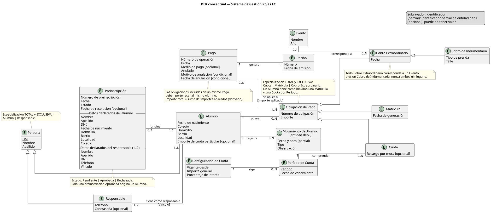

# Modelo conceptual — revisión

**Trabajo Final Integrador — Sistema de Gestión Rojas FC**

Este documento presenta el **modelo conceptual** del sistema de gestión de Rojas FC. Se construye a partir de los requisitos funcionales, los requisitos no funcionales, las reglas de negocio, las decisiones confirmadas con Rojas FC y las devoluciones docentes recibidas sobre las versiones anteriores.

El modelo representa el dominio mediante **entidades, atributos, relaciones, cardinalidades, especializaciones y restricciones**. No incluye decisiones del modelo lógico o físico: claves foráneas, tablas intermedias, tipos de datos, índices ni triggers.

Se indican únicamente los **identificadores que surgen naturalmente del dominio**. Las entidades que no tienen un identificador natural definido por el negocio no reciben uno artificial: su identificación se analizará en la etapa de claves y restricciones (#13).

---

## 1. Criterio de modelado

Un elemento del dominio se modela como **entidad** cuando tiene varias ocurrencias y **atributos o relaciones propias que lo distinguen del resto**. Si no cumple esa condición, se modela como atributo, como relación o queda fuera del modelo.

Cada entidad, atributo y relación se justifica con un requisito, una regla de negocio o una decisión confirmada con Rojas FC. No se agregan atributos solamente para completar entidades.

---

## 2. Entidades y atributos

Referencias: **identificador** · *(d)* derivado · *(opc.)* opcional · *(parcial)* identificador parcial de entidad débil.

### Persona

Representa a una persona registrada en el sistema.

| Atributo | Observación |
|---|---|
| **DNI** | Identificador. No deben existir dos Personas con el mismo DNI (RN-02, RN-08) |
| Nombre | |
| Apellido | |

### Alumno

Especialización de Persona. Representa al alumno de la escuela (RF-01).

| Atributo | Observación |
|---|---|
| Fecha de nacimiento | |
| Dirección: Domicilio, Barrio, Localidad | Atributo compuesto |
| Colegio | |
| Importe de cuota particular | *(opc.)* RF-24, RN-18 |
| Categoría | *(d)* Año de nacimiento (RF-16, RN-10) |
| Estado (activo/inactivo) | *(d)* Último Movimiento de Alumno |
| Moroso | *(d)* Al menos una cuota vencida con saldo (RN-26) |

El Alumno no posee acceso al sistema.

### Responsable

Especialización de Persona. Representa al adulto responsable de uno o más alumnos (RF-06).

| Atributo | Observación |
|---|---|
| Teléfono | |
| Contraseña | *(opc.)* Acceso al portal con DNI y contraseña (RF-11, RF-15) |

La contraseña es opcional porque un Responsable puede estar registrado sin haber activado su acceso al portal.

### Personal Administrativo

Especialización de Persona. Representa el perfil que los requisitos denominan **Administrador/Coordinador**.

| Atributo | Observación |
|---|---|
| Contraseña | Obligatoria: se autentica con DNI y contraseña para acceder a las funciones de gestión (RF-58, RF-59) |

Además de su atributo, se distingue por las operaciones que realiza: registra los movimientos de los alumnos y registra y anula pagos.

### Tipo de Vínculo

| Atributo | Observación |
|---|---|
| **Nombre** | Identificador. Valores: Madre, Padre, Tutor (RN-09) |

Se modela como entidad para no repetir el vínculo como texto en cada relación entre alumno y responsable.

### Preinscripción

Representa un formulario de preinscripción **pendiente de revisión** (RF-17 a RF-20, RN-11 a RN-14).

| Atributo | Observación |
|---|---|
| Fecha | |
| Datos del alumno: Nombre, Apellido, DNI, Fecha de nacimiento, Domicilio, Barrio, Localidad, Colegio | Atributo compuesto |

La Preinscripción es **temporal**. Mientras está pendiente, los datos declarados permanecen solo en ella: no se crean todavía Persona, Alumno ni Responsable. Al **aceptarse**, la información validada se utiliza para crear o actualizar los registros definitivos, se registra el Movimiento de Alta o de Reactivación y la Preinscripción se elimina. Al **rechazarse**, también se elimina (RN-49).

Por eso la Preinscripción **no se relaciona con Alumno**: los datos nunca están registrados en los dos lugares al mismo tiempo, lo que evita la duplicación del DNI observada en la devolución docente.

Su identificación, junto con la de Responsable declarado, se resolverá en la etapa de claves (#13).

### Responsable declarado

**Entidad débil**, dependiente de Preinscripción. Representa cada responsable informado en el formulario (uno o dos, RN-11, RN-12).

| Atributo | Observación |
|---|---|
| DNI | *(parcial)* Distingue a los responsables de una misma preinscripción |
| Nombre | |
| Apellido | |
| Teléfono | |

Su vínculo con el alumno se indica mediante Tipo de Vínculo. Se elimina junto con la Preinscripción.

### Movimiento de Alumno

**Entidad débil**, dependiente de Alumno. Representa cada cambio administrativo del alumno (RF-04, RF-05, RF-51).

| Atributo | Observación |
|---|---|
| Fecha y hora | *(parcial)* Se identifica por el Alumno junto con su fecha y hora |
| Observación | *(opc.)* |

La hora permite distinguir dos movimientos del mismo día, por ejemplo una baja por error y su reactivación inmediata.

### Tipo de Movimiento

| Atributo | Observación |
|---|---|
| **Nombre** | Identificador. Valores: Alta, Baja, Reactivación |

### Configuración de Cuota

Condiciones generales para generar las cuotas (RF-21, RF-26, RN-22).

| Atributo | Observación |
|---|---|
| **Vigente desde** | Identificador. Un cambio realizado el mismo día de vigencia corrige la configuración existente |
| Importe general | |
| Porcentaje de interés | |

### Período de Cuota

| Atributo | Observación |
|---|---|
| **Período** | Identificador (por ejemplo, 2026-03) |
| Fecha de vencimiento | Única para todas las cuotas del período (RF-23, RN-19) |

### Obligación de Pago

Superclase. Representa una obligación económica concreta de un Alumno.

| Atributo | Observación |
|---|---|
| Importe | |
| Saldo | *(d)* Importe menos los importes aplicados por pagos no anulados |

### Cuota

Especialización de Obligación de Pago. Representa la obligación mensual de un Alumno (RF-22).

| Atributo | Observación |
|---|---|
| Recargo por mora | *(opc.)* Monto del interés aplicado al vencer impaga |
| Estado (Pendiente, Vencida, Pagada) | *(d)* Vencimiento del período y pagos aplicados |

El recargo se registra porque conserva el valor aplicado aunque luego cambie el porcentaje configurado (RN-23) y permite asegurar que se aplique una sola vez (RN-21). El período y el vencimiento se obtienen de Período de Cuota.

### Matrícula

Especialización de Obligación de Pago. Representa la obligación correspondiente al primer ingreso del Alumno (RF-31, RN-29).

| Atributo | Observación |
|---|---|
| Fecha de matriculación | *(d)* Fecha del Movimiento de Alta que la origina |

Su importe lo define el Administrador/Coordinador al realizar la inscripción (RN-48). Solo el Movimiento de Alta la origina, por lo que una reactivación no genera una nueva (RN-30). Se abona en su totalidad en una única operación (RN-31).

### Cobro Extraordinario

Especialización de Obligación de Pago. Obligación no periódica correspondiente a un evento o a un pedido de indumentaria (RF-41, RN-42).

| Atributo | Observación |
|---|---|
| Fecha de generación | |

Admite pagos parciales (RN-43) y no está sujeto al interés por mora (RN-46). Un cobro correspondiente a un evento representa la participación confirmada del alumno: no todos los alumnos participan de cada evento.

### Cobro de Indumentaria

Especialización de Cobro Extraordinario.

| Atributo | Observación |
|---|---|
| Tipo de prenda | RF-44, RN-45 |
| Talle | RF-44, RN-45 |

En Rojas FC cada pedido corresponde a una sola prenda, genera un único cobro y no se administra un ciclo de pedido o entrega por separado. Por eso el pedido y su cobro se modelan como una única entidad: separarlos crearía una relación 1:1 entre dos entidades que representan el mismo hecho. La situación es distinta de Evento, que genera cobros para muchos alumnos.

### Evento

| Atributo | Observación |
|---|---|
| **Nombre + Año** | Identificador compuesto: un mismo evento puede repetirse en distintas ediciones |

### Pago

Operación económica registrada en el sistema (RF-32 a RF-35).

| Atributo | Observación |
|---|---|
| Fecha | |
| Motivo de anulación | *(opc.)* Obligatorio si el pago está anulado (RN-36) |
| Fecha de anulación | *(opc.)* Obligatoria si el pago está anulado |
| Anulado | *(d)* El pago está anulado si tiene fecha de anulación |
| Importe total | *(d)* Suma de los importes aplicados |

La anulación se modela con atributos de Pago porque no tiene identidad propia: existe solo si existe el Pago y como máximo una vez por pago.

### Medio de Pago

| Atributo | Observación |
|---|---|
| **Nombre** | Identificador. Valores: Efectivo, Transferencia (RN-33) |

### Recibo

Comprobante correspondiente a un Pago (RF-36, RN-38).

| Atributo | Observación |
|---|---|
| **Número** | Identificador (RN-39) |
| Fecha de emisión | |

---

## 3. Especializaciones

| Superclase | Subclases | Tipo | Justificación |
|---|---|---|---|
| Persona | Alumno, Responsable, Personal Administrativo | **Total y exclusiva** | Toda Persona pertenece exactamente a uno de los tres subtipos, según el alcance definido para Rojas FC |
| Obligación de Pago | Cuota, Matrícula, Cobro Extraordinario | **Total y exclusiva** | Cada tipo de obligación tiene reglas propias |
| Cobro Extraordinario | Cobro de Indumentaria | **Parcial** | Los cobros que no son de indumentaria corresponden a un Evento |

---

## 4. Relaciones y cardinalidades

En el diagrama, el número junto a una entidad indica cuántas ocurrencias de esa entidad se vinculan con una ocurrencia de la entidad del otro extremo.

| # | Relación | Cardinalidades | Justificación |
|---|---|---|---|
| R1 | **tiene como responsable** (ternaria): Alumno, Responsable y Tipo de Vínculo | Cada Alumno tiene 1 a 2 Responsables · cada Responsable tiene 1 a N Alumnos · cada par Alumno–Responsable tiene 1 Tipo de Vínculo | RN-01, RN-05, RN-07, RN-09 |
| R2 | Preinscripción — **declara** — Responsable declarado | 1 — 1..2 | RF-17, RN-11, RN-12 |
| R3 | Tipo de Vínculo — **indica vínculo** — Responsable declarado | 1 — 0..N | RN-09 |
| R4 | Alumno — **registra movimiento** — Movimiento de Alumno (identificadora) | 1 — 1..N | RF-04, RF-05, RF-51 |
| R5 | Personal Administrativo — **realiza** — Movimiento de Alumno | 1 — 0..N | RF-04, RF-05, RNF-14 |
| R6 | Tipo de Movimiento — **clasifica** — Movimiento de Alumno | 1 — 0..N | RF-51 |
| R7 | Movimiento de Alumno — **origina** — Matrícula | 1 — 0..1 | RN-29, RN-30 |
| R8 | Alumno — **posee** — Obligación de Pago | 1 — 0..N | RN-42, RF-28 |
| R9 | Configuración de Cuota — **rige** — Período de Cuota | 1 — 0..N | RN-17, RN-23 |
| R10 | Período de Cuota — **comprende** — Cuota | 1 — 0..N | RF-23, RN-19 |
| R11 | Evento — **corresponde a** — Cobro Extraordinario | 0..1 — 0..N | RF-41 |
| R12 | Pago — **se aplica a** — Obligación de Pago | Cada Pago se aplica a 1..N Obligaciones · cada Obligación recibe 0..N Pagos. Atributo: **Importe aplicado** | RF-34, RF-42 |
| R13 | Personal Administrativo — **registra pago** — Pago | 1 — 0..N | RF-32 |
| R14 | Personal Administrativo — **anula** — Pago | 0..1 — 0..N | RF-35, RN-36 |
| R15 | Medio de Pago — **se abona con** — Pago | 0..1 — 0..N | RN-33, RN-34 |
| R16 | Pago — **genera** — Recibo | 1 — 0..1 | RN-38, RF-61, RF-64 |

**Pago y Recibo.** Cuando hay conexión, al registrarse el Pago se genera automáticamente su Recibo. Cuando no la hay, el Pago queda registrado igual y el Recibo se genera automáticamente al restablecerse la conexión, una vez sincronizado y validado (RF-61, RF-64). Por eso un Pago puede existir transitoriamente sin Recibo. La relación misma indica si el recibo ya fue emitido, por lo que no se agrega un atributo para eso.

**Relación que no se dibuja:** Alumno — Pago. Sería redundante, porque el alumno de un pago se obtiene a través de las obligaciones a las que se aplica.

---

## 5. Restricciones

### Dominio y unicidad

1. No hay dos Personas con el mismo DNI (RN-02, RN-08).
2. Los importes son mayores que cero; el porcentaje de interés es mayor o igual que cero (RN-22).
3. Un Alumno tiene como máximo una Cuota por Período de Cuota.
4. Existe una sola Configuración de Cuota por fecha de vigencia.

### Personas y acceso

5. Toda Persona es exactamente Alumno, Responsable o Personal Administrativo.
6. Responsable y Personal Administrativo ingresan con DNI y contraseña. La contraseña es obligatoria para el Personal Administrativo y opcional para el Responsable. El Alumno no posee acceso al sistema (RF-11, RF-58).

### Preinscripción

7. Mientras la Preinscripción está pendiente, sus datos no se registran en Persona, Alumno ni Responsable (RN-13, RN-14).
8. Al recibir una Preinscripción, el sistema compara los DNI declarados con los registrados: si el alumno está inactivo, la aceptación registra una Reactivación; si está activo, la solicitud no corresponde; si un responsable ya existe, se reutiliza (RF-17, RN-08).
9. Una Preinscripción aceptada o rechazada se elimina (RN-49).
10. Una Preinscripción no genera obligaciones económicas (RN-47).

### Alumnos y movimientos

11. Cada Alumno tiene un único Movimiento de tipo Alta, que es el primero de su historial.
12. Una Baja solo puede registrarse si el alumno está activo, y una Reactivación solo si está dado de baja (RN-03, RN-04).

### Cuotas

13. Las cuotas se generan el día 1 de cada mes, solo para alumnos activos (RN-15, RN-16).
14. El importe de la cuota es el importe particular del alumno si lo tiene; si no, el importe general de la Configuración que rige el período (RN-17, RN-18).
15. El recargo por mora se aplica una sola vez, solo si la cuota venció impaga, con el porcentaje de la Configuración del período (RN-20, RN-21).
16. Solo puede corregirse el importe de las cuotas pendientes del período en curso; una cuota pagada no se modifica (RN-24, RN-25).
17. Una Cuota se abona en una única operación cuyo importe aplicado es exactamente el total adeudado (RN-32). No admite pagos parciales ni saldo a favor.

### Matrícula y cobros extraordinarios

18. Solo un Movimiento de tipo Alta origina una Matrícula (RN-30).
19. La Matrícula se abona en una única operación por su importe exacto (RN-31).
20. Todo Cobro Extraordinario corresponde a un Evento o es un Cobro de Indumentaria, nunca ambos ni ninguno.
21. Un Cobro Extraordinario admite pagos parciales (RN-43), pero la suma de los importes aplicados por pagos no anulados no puede superar su importe. Si se recibe de más, la administración devuelve la diferencia y solo se registra lo efectivamente cobrado.

### Pagos y recibos

22. Un Pago corresponde a exactamente un Alumno, determinado a través de las Obligaciones a las que se aplica.
23. Si el Pago está anulado, son obligatorios el Motivo, la Fecha de anulación y el integrante del Personal Administrativo que lo anuló (RN-35, RN-36). La Fecha de anulación es igual o posterior a la Fecha del Pago.
24. Todo Pago genera exactamente un Recibo; si se registró sin conexión, el Recibo se genera al sincronizarse y validarse (RN-38, RF-64).
25. La anulación de un Pago no elimina su registro ni su Recibo; el Recibo pasa a considerarse anulado (RN-37, RN-41, RF-40).

---

## 6. Datos derivados

Se representan en el diagrama precedidos por "/" porque forman parte del dominio, aunque se calculen a partir de otros datos.

| Atributo | Se obtiene de |
|---|---|
| Categoría, Estado y Moroso del Alumno | Año de nacimiento, último Movimiento y cuotas vencidas con saldo |
| Saldo de una Obligación | Importe menos importes aplicados por pagos no anulados |
| Estado de una Cuota | Vencimiento del período y pagos aplicados |
| Fecha de matriculación | Fecha del Movimiento de Alta |
| Anulado e Importe total del Pago | Fecha de anulación y suma de importes aplicados |

**Saldo y RN-44.** RN-44 exige conservar el saldo pendiente de un cobro extraordinario. Se cumple aunque el saldo sea derivado: se obtiene siempre del importe menos los pagos no anulados, información que nunca se elimina (RN-35, RN-37). Lo mismo vale para el saldo informado en el recibo de un pago parcial (RF-36).

---

## 7. Elementos que no forman parte del modelo

- **Usuario** como entidad separada y **correo electrónico**: ningún requisito los pide; el acceso se resuelve con DNI y contraseña.
- **Pedido de Indumentaria** separado del cobro: ver Cobro de Indumentaria.
- **Anulación** como entidad: ver Pago.
- **Identificadores técnicos** (códigos o números asignados): se analizarán en #13.
- **Historial de preinscripciones procesadas**: no requerido (RN-49).
- **Saldo a favor**: las reglas de pago total de cuotas y matrícula lo impiden, y en los cobros extraordinarios se devuelve el excedente.
- **Categoría, Colegio, Barrio y Localidad** como entidades: son atributos del Alumno.
- **Mecanismos de sincronización offline y auditoría técnica**: decisiones de etapas posteriores.

---

## 8. DER conceptual

El diagrama se genera con PlantUML a partir de [`der-conceptual.puml`](./der-conceptual.puml).

---

## 9. Cambios respecto de la versión presentada anteriormente

| # | Cambio | Motivo |
|---|---|---|
| 1 | **Administrador** pasa a **Personal Administrativo**, con Contraseña y las relaciones realiza, registra pago y anula | Tenía atributos solo heredados y ninguna relación. Ahora tiene atributo propio y representa quién opera (RF-58, RF-32, RF-35, RNF-14) |
| 2 | Se elimina **Usuario**; la contraseña pasa a Responsable (opcional) y a Personal Administrativo | Usuario tenía un único atributo y no tenía identificador propio |
| 3 | **Preinscripción** temporal, sin relación con Alumno, con **Responsable declarado** como entidad débil | Evita registrar el DNI en dos lugares, como se observó en la devolución docente (RN-49) |
| 4 | Se incorporan **Tipo de Vínculo**, **Tipo de Movimiento** y **Medio de Pago** como entidades | Evita valores repetidos como texto, como se observó con el medio de pago |
| 5 | **Cuota** incorpora Recargo por mora; **Matrícula**, Fecha de matriculación derivada y su relación con el Movimiento de Alta | Subtipos que no tenían atributos propios |
| 6 | **Pedido de Indumentaria** se integra como **Cobro de Indumentaria** | El pedido y su cobro estaban en relación 1:1 obligatoria y representan el mismo hecho |
| 7 | **Evento** se relaciona directamente con Cobro Extraordinario | Un subtipo "Cobro de Evento" no tendría atributos propios |
| 8 | Los **atributos derivados** se representan en el diagrama; Anulado e Importe total de Pago pasan a derivados | Evita almacenar información que se obtiene de otros datos |
| 9 | Solo se indican **identificadores naturales**; el resto se resuelve en #13 | Evita adelantar decisiones del modelo lógico o físico |
| 10 | Se agregan restricciones de unicidad, de acceso, de preinscripción, de secuencia de movimientos y de importes | El modelo no las expresaba |
| 11 | Ajustes en RF-58 y en las reglas RN-48 y RN-49 | Formalizan decisiones confirmadas con Rojas FC |

---

## 10. Próximos pasos

1. Validar este modelo conceptual con el tutor.
2. Definir claves y restricciones de integridad, incluida la identificación de Preinscripción, Responsable declarado, Obligación de Pago y Pago (#13).
3. Construir el modelo relacional y actualizar `schema.sql` (#14).
4. Generar el diagrama de tablas con MySQL Workbench mediante ingeniería inversa.
